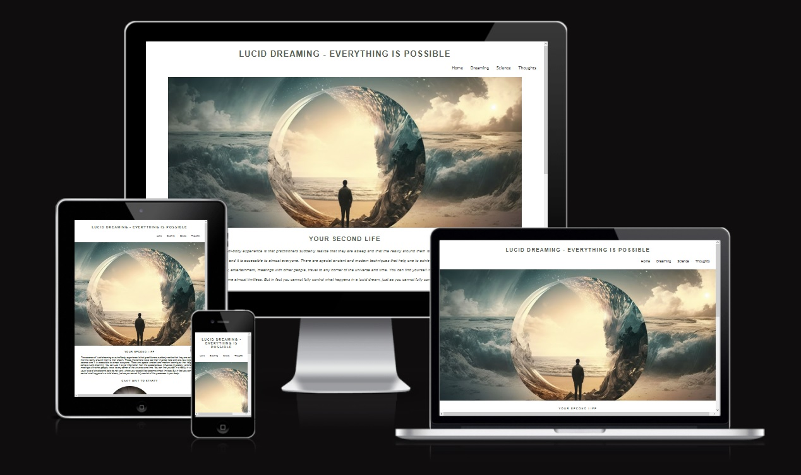
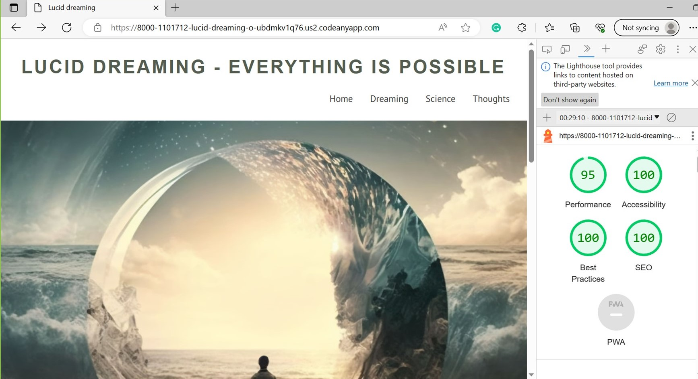
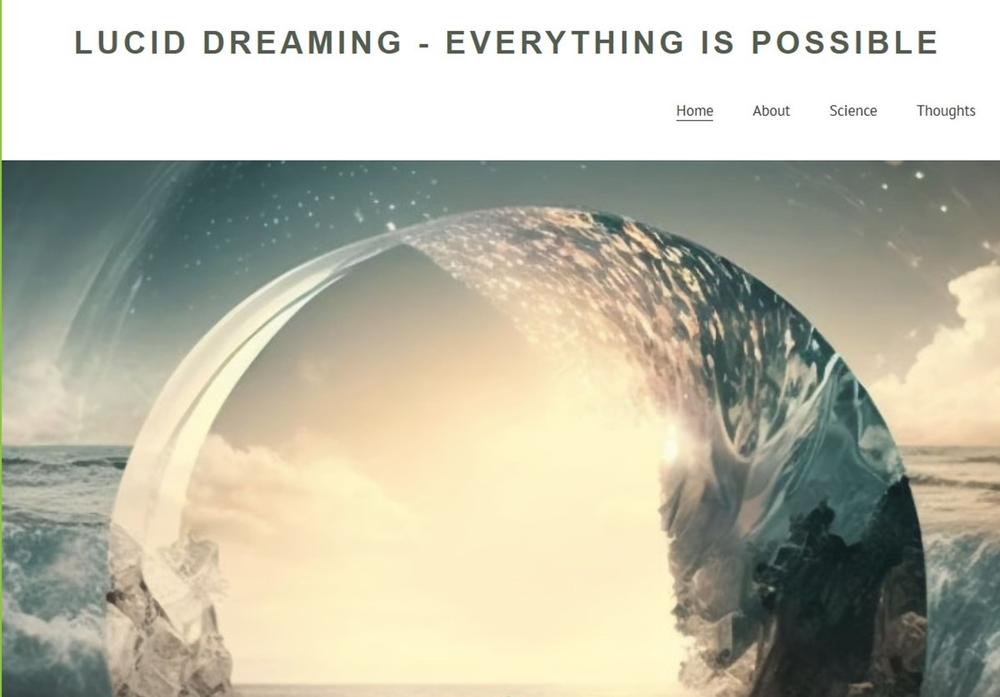
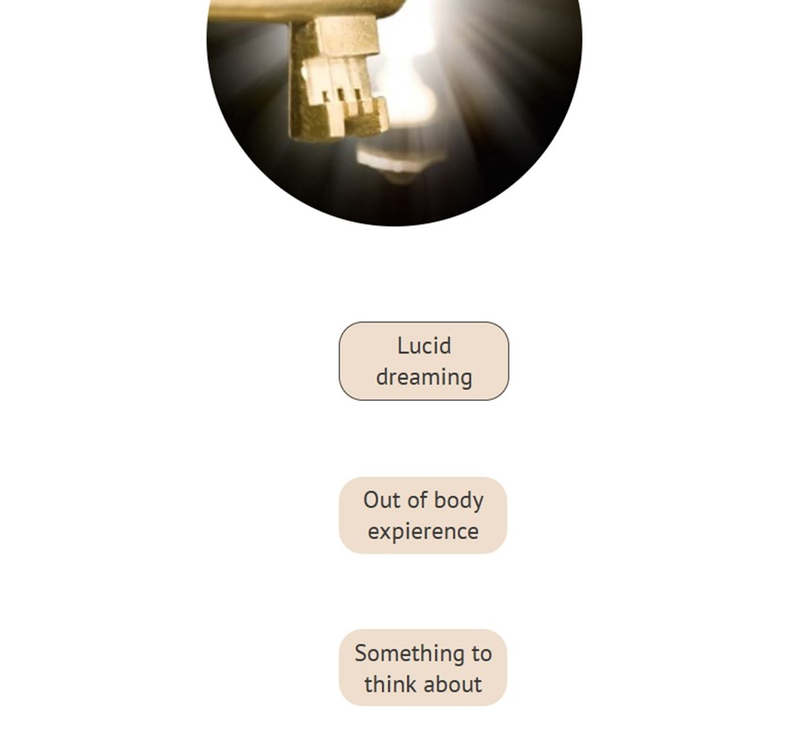
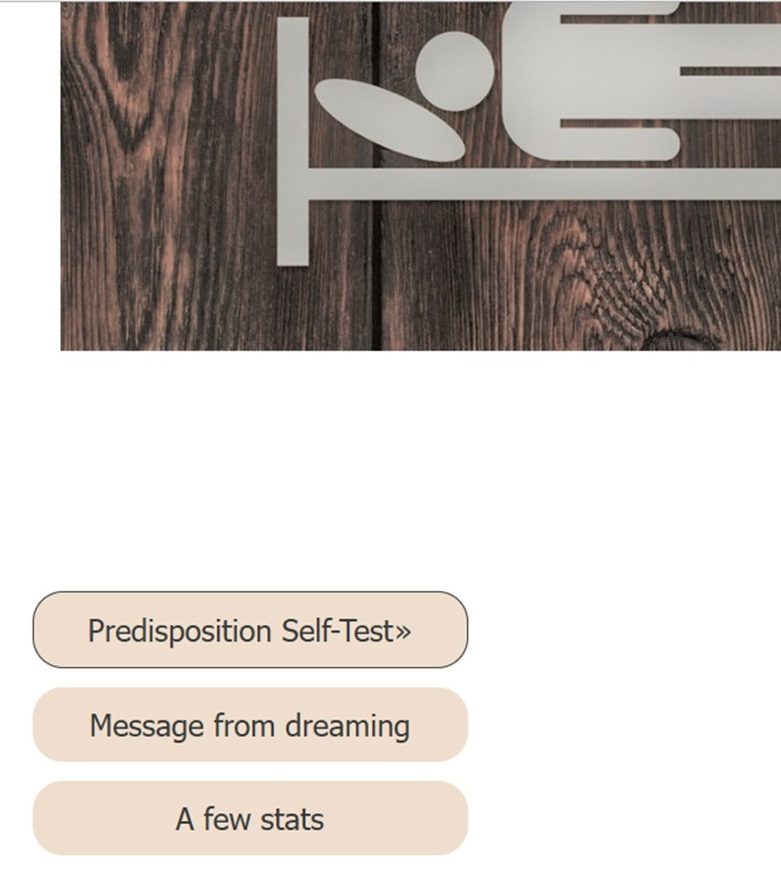
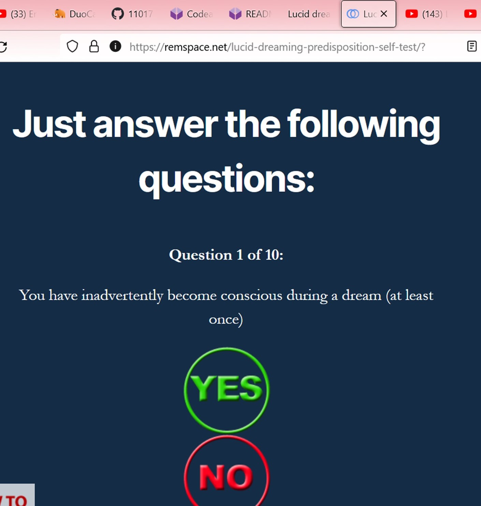
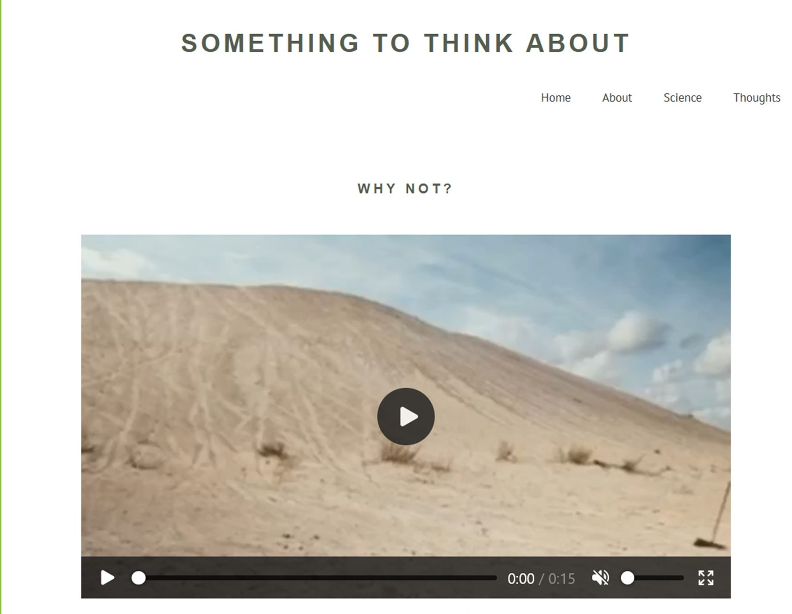
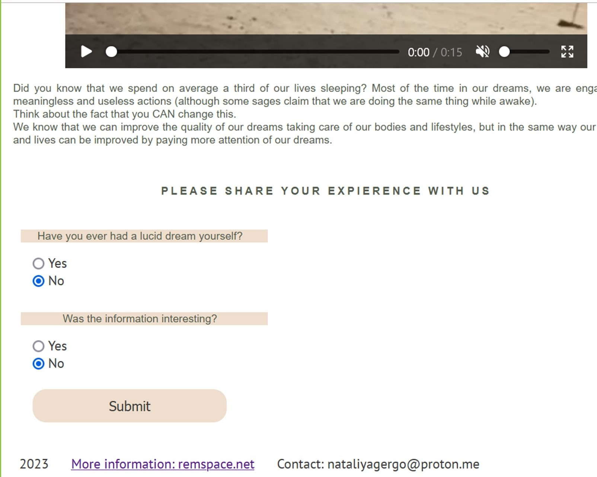
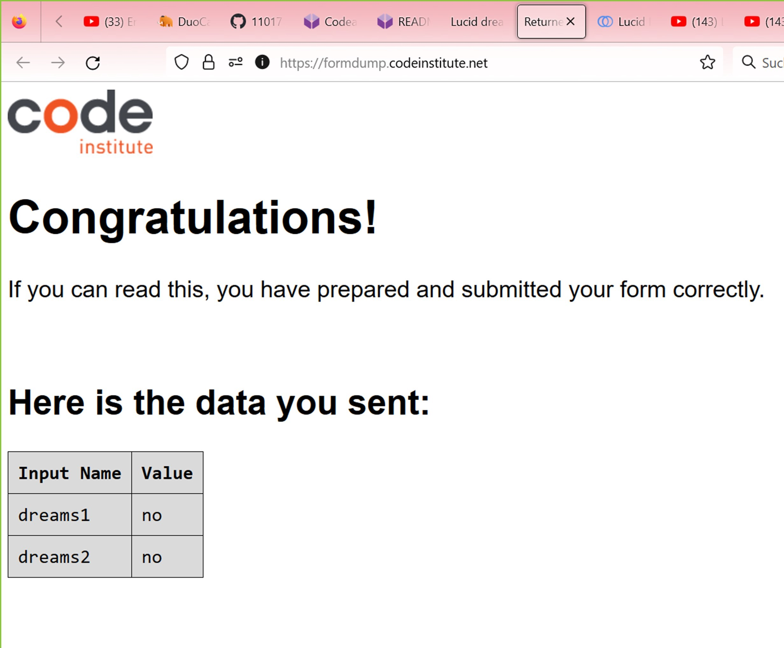

# LUCID DREAMING

Lucid Dreaming is a site that hopes to help people learn and understand what lucid dreams are about and what science says about them. With the help of a test on a link on a third-party website, you can find out your individual predisposition to lucid dreams. My site hopes to encourage people to get their own personal experience of awareness in a dream. To do this, there is a link to a third-party website with detailed step-by-step instructions.

 ## Features
My site has 4 pages. All of them are devoted to the topic of lucid dreams.
The main page contains the main image with a zoom effect and common information about lucid dreams. 
The second page provides information about what lucid dreaming is, techniques for starting practice and links to official free books. 
The third page informs the visitor about the scientific side of this issue. 
The fourth page hopes to keep visitors motivated by trying the practice of lucid dreaming. There is also a video on this page.

## Existing Features

+ Navigation Bar
  + Featured on all four page, the fully responsive navigation bar includes links to the Home page, Lucid Dreaming page (Dreaming)), A Scientists View page (Science), Why Not page (Thoughts) and is identical in each page to allow for easy navigation.
  + This section will allow users to easily navigate with all devices without having to revert to the previous page via the "back" button.
+ The landing page image
  + The landing page includes an image with an animation effect. Thanks to this, visitors of the site can feel the effect of being involved in the plot of the image, immersion in another reality, reality of lucid dreaming.
  + Further, after a brief definition of a lucid dream, there is an image of a keyhole and three buttons below it, which duplicate navigation, but represent a more aesthetic solution in the form of buttons with more detailed text on them.
This should intrigue users and stimulate their interest in getting more detailed information.
+ The Lucid Dreaming page 
    + The page is designed with a Midjourney-generated image of a possible lucid dream plot. The image is followed by a description of a typical subjective experience of falling into a lucid dream. After that, the user is asked to click on the buttons, which are links to third-party sites with more detailed information. To represent their role, these buttons have an animated "hover feature" with arrows appearing when user hovers her cursor over them. These buttons will open the link in a new window, so that the user stays on the website after checking out the suggested external content.
+ The Scientists view page is designed with a pictogram. This sign should cause a subconscious association with more official information. The general concept and design of this page repeats the conceptual solution of the page described above.
+ The Something to think about page 
   + This page should encourage users to consider lucid dreaming as their new expierence. To do this, a video with a short text below it is embedded in the page. Using the video tool the video allow users to initiate and control the playing of it. 
   + At the end, a short survey is embedded on site in the form of a radiobattons. By doing this, I make it clear to site visitors that their opinion is important to me.
+ The Footer 
The Footer section includes link to our other site and the Email address of the  author of this site. The link will open in a new window to allow easy navigation for the users. 
## UX
### Site goals
The purpose of the Lucid Dreaming website is to introduce users to lucid dreaming. Those who already have experience of lucid dreams may be able to find additional detailed useful information.

Users are also given the opportunity to
take a test for a predisposition to lucid
dreaming on a third-party website.The test is available on the website of the research laboratory, the results of which are published in specialized scientific journals.

It is also the goal to make it easy for users to find all the nesessary and trustworthy information in one place. The site should be easily navigated as well as aesthetically pleasing.

The three types of buttons enabling an intuitive UX
1. The first type, are buttons representing internal links, and they are separate from the usual navigation menu. The "hover feature" simply underlines the button when user hovers their cursor over them. This
highlights the fact that the button is an active link.
2. The second type are buttons leading to other websites. To represent their role, they have an animated
"hover feature" with arrows appearing when user hovers her cursor over them. These buttons will open
the link in a new window, so that the user returns to the website after checking out the suggested external
content.
3. The third type is the "Submit" button in the UX survey. It does not have a "hover feature" due to it not
being an active link. The address for the action is taken from the example from CodeInstitute given to verify the form is being submitted correctly. To keep site open, used "_blank" to open in new window.
- Another aspect is that by default, buttons are not links. To override this by buttons on Lucid-Dreaming and Out-Of-Body pages, I used my CSS knowledge. In order to make my buttons to also be active links, I have used the method **get** and pasted the link in
the action. So since there is no "form" to be submitted, the button will now open the link mentioned in the
"action".

#### Dupes of the navigation
Stylistically speaking, the navigation should be attached to the top of the page. However, on the main
(index) page you will see that the navigation is duplicated at the bottom of the page. It was a design decision
of mine,

## Testing
+ The site was tested in Mozilla-Firefox, Microsoft-Edge and Google-Chrome, on different screensizes and devices. Reduced and increased, no problems seen. 
+ HTML 
   + [official W3C validator](https://validator.w3.org/) no error was found.
+ CSS
   + No errors were found when passing through the [official Jigsaw validator](http://jigsaw.w3.org/css-validator/validator?lang=de&profile=css3svg&uri=https%3A%2F%2F8000-1101712-lucid-dreaming-o-ubdmkv1q76.us2.codeanyapp.com%2F&usermedium=all&vextwarning=&warning=1)
+ Accessibility
   + I confirmed that the colors and fonts chosen are easy to read and accessible by running it through lighthouse in devtools

As a part of my commitment to the disabled community, all relevant images have alternative text attached to them. 
## Manual testing
Manual testing of all links and necessary features was done in previously mentioned browsers and devices with a positive result. All pages linked correctly, all features worked correctly, external links open in new window, the video plays correctly including all manual controls as required.
|Feature      |Expect        |Action      |Result      |
|:--------- |:---------------|:---------------|:----------------|
|Home navigation   |When clicked the home page will open |Clicked Home on the Nav bar|Home page opened when clicked|
|Hero image|Will zoom in on page load|Open or refreshed the Home page|Performs the zoom effect correctly|
|Ext. link buttoms|On hover will action animated. Click event link to new window|Hover and clicked the button|On hover cction animated. Link opened in new window|
|Form submit button|Form submits when submit button is clicked. The result opens in new window|Clicked the submit button on the form.| The form succesfully submitted on click. The result opened in new window|
|Video object|User has full control from opening the page, To play upon request and not at startup|Opening the page. Play video|Video does't play at startup. The video is full controlled|

## Manual testing of user stories
### Expectation:
 A visitor should understand the main purpose of the site. 
### Result:
As a visitor, I understand that this is a website to help me to learn about lucid dreaming.
### Expectation:
A visitor needs easy intuitive navigation around the site.
### Result
As a visitor I can easy understand the navigation.
### Expectation
A visitor expect all external link will be open in a new window.
### Result:
As a visitor I see that all external link open in a new window.
### Expectation
A visitor want video does't play at startup and be full controlled.
### Result
As a visitor I see that want video does't play at startup and is full controlled.
### Expectation
A visitor needs a link to enable themselves to do a self-assessment.
### Result
As a visitor I find a link to predisposition self-test.
### Unfixed Bugs

by testing by [official W3C validator](https://validator.w3.org/) no error was found.

## Fixed Bugs

### HTML Bugs
1. The for attribute of the label elements did not match the corresponding id of the input elements in the survey form. This has been corrected to ensure proper form accessibility and functionality.
2. There was an error in the HTML code for the images. The src attribute for the images was not included. This has been added to display the images correctly.
3. The footer elements were placed outside the body tags in all the pages. They have now been moved inside the body tags to ensure proper HTML structure and compliance with the standard.
   
### CSS Bugs

1. The text-transform: italics value in the p selector was invalid. This was corrected to font-style: italic.
2. The border-color: none and border-width: none properties in the #key-container selector were invalid. These were replaced with border: none.
3. The text-size: 110% property in the #under-movie selector was invalid. This was corrected to font-size: 110%.
4. The padding: 20 property in the .right-about selector was missing a unit in the media query for 'min-width: 1511px'. This was corrected to padding: 20px.
5. Font family names with spaces, such as PT Sans, were not enclosed in quotation marks. This was corrected throughout the stylesheet to improve compatibility and avoid possible parsing errors.
6. Incorrect usage of the font-weight property was corrected.
   
## Initial Validation Experience
During the preliminary stages of validating the Lucid Dream website, a methodological error was encountered that led to a misunderstanding of the actual state of the code. Instead of directly inputting the source HTML code into the validator, the URL of the webpage was submitted for the validation process.

The assumption that the validator would analyze the HTML structure and CSS from the webpage URL resulted in an array of confusing validation results. Errors and warnings, which seemed not to align with the actual structure and quality of the code, were produced, leading to an undue debugging process.

The root of this discrepancy was realized upon the discovery that submitting the webpage URL to the validator might include server-side code or other dynamic elements on the webpage, causing a distortion in the validation outcome.

## Deployment

The project was deployed to GitHub Pages using the following steps:

1. Log in to GitHub and locate the GitHub Repository;
2. At the top of the Repository itself, locate the "Setting" button on the menu;
3. In the Settings page choose the "GitHub Pages" Section;
4. In the "GitHub Pages", under "Source", click the dropdown called "None" and select the "Master
Branch". The page should refresh automatically;
5. Scroll down the page to locate the now published site link in the "GitHub Pages" section.
   
## Credits

### Content

+ The text for the Home page was partly taken from [remspace](https://remspace.net/).
+ The rest of the text was composed by me and is my intellectual propertyю
+ The idea how to add an onklick event to button was taken from [w3docs](3https://www.w3docs.com/snippets/html/how-to-create-an-html-button-that-acts-like-a-link.html)
+ The instruction how to creat zoom-effect to Hero image was taken from [special tutorium from CodeInstitute](https://www.youtube.com/watch?v=nAqcFCD7SD8&t=246s&ab_channel=MediaUploa)
+ The instruction how to creat README file was taken from CodeInstitute Educational materials. [CodeInstituteREADME template](https://github.com/Code-Institute-Solutions/readme-template), Codeinstitute README presentation and [markdownlivepreview](https://markdownlivepreview.com/). 
+ This reference list would not be complete without mentioning the beginner resourses for front-end at
[W3Schools](https://w3schools.com)
+ And extensive notes and tips hosted at the [Mozilla Foundation]
(developer.mozilla.org), the home of the worlds' best web browser Firefox. 
+ And, of course, a thanks goes
to the friendly part of the [StackOverFlow](https://stackoverflow.com), for helping to pinpoint and fix the
little bugs and features in my code. 
### Media
1. Unless stated otherwise, the image for Lucid-Dreaming page I have AI-generated for non-profit use (education/student projects)
via the [MidJourney](https://www.midjourney.com) neural network;
1. The other images including Home page Hero image are licenced for non-profit use (education/student projects) via [DreamsTime](https://www.dreamstime.com/).
2. The video is licenced via the [Pexels](https://pexels.com).

### Languages used
- [HTML5](https://de.wikipedia.org/wiki/HTML5)
- [CSS3](https://www.w3.org/Style/CSS/)
### Frameworks, Libraries & Programs used

1. [Google Fonts](https://fonts.google.com/specimen/PT+Sans)
- The "Google fonts" tool was used to impoirt the fonts into the style.css file, which is used in this project.
2. [PT Font Family](https://company.paratype.com/pt-sans-pt-serif)
- The fonts from the PT Family were chosed to make the website futureproof. As already mentioned, I
plan on adding multilanguage support to this project, and the Paratype fonts are built around non-latin
characters, such as the Cyrillic alphabet and special charachters used in post-Soviet countries, which
are very rare to find in fonts produced in the anglophone world. While dealing with an impressive amount
of letters from different language families, the PT font never compromises on aestetics - it has been
created by the internationally acclaimed typeface designer [Alexandra Korolkova](https://en.wikipedia.org/wiki/Alexandra_Korolkova) and Olga Umpelova.
However, should the project grow big enough to be translated into east-Asian or south-Asian languages,
new fonts shall be added to support, for example, Japanese or Thai fonts.
4. [GitHub](https://github.com/) - used for version control.
5. [W3C](https://validator.w3.org/#validate_by_input) - used for HTML validation.
6. [W3C](https://jigsaw.w3.org/css-validator) - used for CSS validation.
## Acknowledgements
- to Kay Welfare for great psyhological support and motivation.
- - To my mentor Antonio Rodriguez for helping to resolve the technical questions.
- I would like to mentions Openais ChatGPT, which gave me a huge opportunity to study quickly and very efficiently.
- To the Code Institute slack community.
