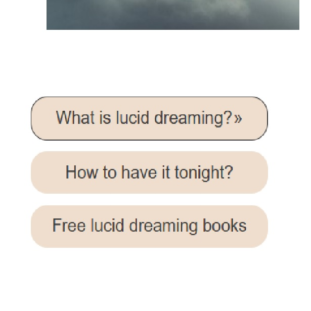
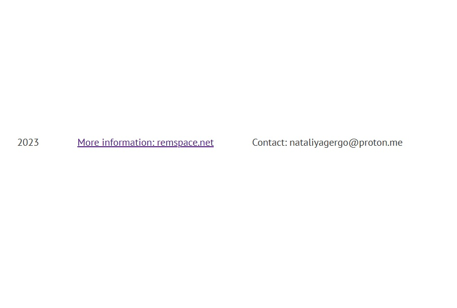

# LUCID DREAMING

Lucid Dreaming is a site that hopes to help people learn and understand what lucid dreams are about and what science says about them. With the help of a test on a link on a third-party website, you can find out your individual predisposition to lucid dreams. My site hopes to encourage people to get their own personal experience of awareness in a dream. To do this, there is a link to a third-party website with detailed step-by-step instructions.

## Site goals

The purpose of the Lucid Dreaming website is to introduce users to lucid dreaming. Those who already have experience of lucid dreams may be able to find additional detailed useful information.

Users are also given the opportunity to
take a test for a predisposition to lucid
dreaming on a third-party website.The test is available on the website of the research laboratory, the results of which are published in specialized scientific journals.

It is also the goal to make it easy for users to find all the nesessary and trustworthy information in one place. The site should be easily navigated as well as aesthetically pleasing.

## Features

The Lucid Dreaming site features four pages, each dedicated to different aspects of lucid dreaming.

### Home Page

The landing page includes an engaging main image with a zoom animation effect that draws visitors into the world of lucid dreaming. Below the main image, visitors will find a definition of lucid dreaming, an intriguing keyhole image, and three distinct mouse-over-responsive buttons which guide users towards more detailed information.

### Lucid Dreaming Page

This page features an engaging image produced by Midjourney, which portrays a potential lucid dream scenario. The image is complemented by a description of the typical experience when entering a lucid dream. Further down the page, animated buttons lead users to third-party sites with more in-depth information on lucid dreaming. These buttons are styled to serve as links to external resources about lucid dreaming.
When hovered over, an arrow appears to the right of the button's text, signaling that it's a link.

### Scientist's View Page

The third page of the site, designed with an authoritative pictogram, provides users with scientific perspectives on lucid dreaming. The design concept of this page mirrors the structure of the Lucid Dreaming Page.

### Something to Think About Page

The final page aims to motivate visitors to embark on the journey of lucid dreaming. It features an embedded video accompanied by an enlightening text. This page also includes a short survey, inviting users to share their opinions on the subject.

### Navigation Bar

Present on all four pages, the responsive navigation bar features links to each page of the site, providing an easy and intuitive navigation experience. This navigation scheme ensures seamless exploration of the site on all devices. The navigation bar includes an indicator that shows the user which page of the site they are currently on. This is implemented as an underline beneath the name of the current page on the navigation bar.

### Footer

The footer includes a link to another related site and the author's email address, providing users with an easy way to explore additional content and contact the author.

## User Experience

### Strategy

The strategy behind the Lucid Dreaming website is to provide an engaging, intuitive, and informative platform for users interested in the concept of lucid dreaming. The design approach is user-centric, focusing on ease of navigation and providing relevant and trustworthy information in one place.

### Structure

The website is structured into four distinct pages, each dedicated to a specific aspect of lucid dreaming: Home, Dreaming, Science, and Thoughts. This clear separation of content allows users to effortlessly find the information they're interested in.

### User Stories

The site caters to two main user groups: newcomers to the concept of lucid dreaming and experienced lucid dreamers looking for additional resources.

1. As a new user, I want to understand what lucid dreaming is and how I can achieve it.
2. As an experienced user, I want to find additional resources and scientific perspectives on lucid dreaming.
3. As a user, I want to easily navigate the website and quickly find the information I'm looking for.

## Interaction Design

The interaction design of the website is driven by the need for simplicity and intuitiveness. It uses three types of buttons for different actions: internal links, external links, and form submissions. The distinct visual and interactive design of these buttons provides users with a clear understanding of the button's function.

All links leading to external sites are designed to open in new tabs, allowing users to explore these resources without navigating away from the Lucid Dreaming website.

Moreover, a unique aspect of the site's design is that certain buttons, specifically on the Lucid-Dreaming and Out-Of-Body pages, also serve as active links. By default, buttons are not links, but to enhance user interaction, I have utilized my CSS knowledge and used the `get` method, inserting the desired URL in the action attribute. This means that even though there is no form to be submitted, clicking on these buttons will still open the associated link.

### Navigation Design

The navigation is streamlined and consistent across all pages. An underline indicator on the navigation bar highlights the current page, helping users understand where they are within the website. This design element enhances the user's ability to navigate the site efficiently.

### Information Architecture

The information on the website is organized logically and accessibly. The homepage gives a brief overview of lucid dreaming, and the subsequent pages delve into more detailed aspects of the subject. This hierarchy of information helps guide the user through their exploration of lucid dreaming.

## Testing

+ The site was tested in Mozilla-Firefox, Microsoft-Edge and Google-Chrome, on different screensizes and devices. Reduced and increased, no problems seen.

+ HTML
  
  + [official W3C validator](https://validator.w3.org/) no error was found.

+ CSS

  + No errors were found when passing through the [official Jigsaw validator](http://jigsaw.w3.org/css-validator/validator?lang=de&profile=css3svg&uri=https%3A%2F%2F8000-1101712-lucid-dreaming-o-ubdmkv1q76.us2.codeanyapp.com%2F&usermedium=all&vextwarning=&warning=1)

+ Accessibility

  + I confirmed that the colors and fonts chosen are easy to read and accessible by running it through lighthouse in devtools.

As a part of my commitment to the disabled community, all relevant images have alternative text attached to them.

## Manual testing

Manual testing of all links and necessary features was done in previously mentioned browsers and devices with a positive result. All pages linked correctly, all features worked correctly, external links open in new window, the video plays correctly including all manual controls as required.
|Feature      |Expect        |Action      |Result      |
|:--------- |:---------------|:---------------|:----------------|
|Home navigation   |When clicked the home page will open |Clicked Home on the Nav bar|Home page opened when clicked|
|Active navigation link|The navigation link of the current page is underlined|Navigate to a page|The navigation link for the current page is underlined, indicating to the user their current location on the site|
|Hero image|Will zoom in on page load|Open or refreshed the Home page|Performs the zoom effect correctly|
|Ext. link buttoms|On hover will action animated. Click event link to new window|Hover and clicked the button|On hover cction animated. Link opened in new window|
|Form submit button|Form submits when submit button is clicked. The result opens in new window|Clicked the submit button on the form.| The form succesfully submitted on click. The result opened in new window|
|Video object|User has full control from opening the page, To play upon request and not at startup|Opening the page. Play video|Video does't play at startup. The video is full controlled|

## Manual testing of user stories

### Expectation for main purpose

A visitor should understand the main purpose of the site.

### Result for main purpose

As a visitor, I understand that this is a website to help me to learn about lucid dreaming.

### Expectation for navigation

A visitor needs easy intuitive navigation around the site.

### Result fot navigation

As a visitor, I find the navigation easy to understand and intuitive.

### Expectation for external links

A visitor expects all external links to open in a new window.

### Result for external links

As a visitor I find that all external links open in a new window as expected.

### Expectation for video

A visitor wants video not to play at startup and be fully controllable.

### Result for video

As a visitor I see that video does not play at startup and is full controllable.

### Expectation for links

A visitor needs a link to enable themselves to do a self-assessment.

### Result for links

As a visitor, I found a link to a self-assessment for predisposition to lucid dreaming.

## Bugs

During the development process, various bugs were encountered. However, through diligent testing and debugging, these issues were addressed and resolved.

### Unfixed Bugs

-by testing by [official W3C validator](https://validator.w3.org/) no error was found.

### Fixed Bugs

### HTML Bugs

1. The for attribute of the label elements did not match the corresponding id of the input elements in the survey form. This has been corrected to ensure proper form accessibility and functionality.
2. There was an error in the HTML code for the images. The src attribute for the images was not included. This has been added to display the images correctly.
3. The footer elements were placed outside the body tags in all the pages. They have now been moved inside the body tags to ensure proper HTML structure and compliance with the standard.

### CSS Bugs

1. The text-transform: italics value in the p selector was invalid. This was corrected to font-style: italic.
2. The border-color: none and border-width: none properties in the #key-container selector were invalid. These were replaced with border: none.
3. The text-size: 110% property in the #under-movie selector was invalid. This was corrected to font-size: 110%.
4. The padding: 20 property in the .right-about selector was missing a unit in the media query for 'min-width: 1511px'. This was corrected to padding: 20px.
5. Font family names with spaces, such as PT Sans, were not enclosed in quotation marks. This was corrected throughout the stylesheet to improve compatibility and avoid possible parsing errors.
6. Incorrect usage of the font-weight property was corrected.

## Initial Validation Experience

During the preliminary stages of validating the Lucid Dream website, a methodological error was encountered that led to a misunderstanding of the actual state of the code. Instead of directly inputting the source HTML code into the validator, the URL of the webpage was submitted for the validation process.

The assumption that the validator would analyze the HTML structure and CSS from the webpage URL resulted in an array of confusing validation results. Errors and warnings, which seemed not to align with the actual structure and quality of the code, were produced, leading to an undue debugging process.

The root of this discrepancy was realized upon the discovery that submitting the webpage URL to the validator might include server-side code or other dynamic elements on the webpage, causing a distortion in the validation outcome.

## Deployment

The project was deployed to GitHub Pages using the following steps:

1. Log in to GitHub and locate the GitHub Repository;
2. At the top of the Repository itself, locate the "Setting" button on the menu;
3. In the Settings page choose the "GitHub Pages" Section;
4. In the "GitHub Pages", under "Source", click the dropdown called "None" and select the "Master
Branch". The page should refresh automatically;
5. Scroll down the page to locate the now published site link in the "GitHub Pages" section.

## Credits

### Content

+ The text for the Home page was partly taken from [remspace](https://remspace.net/).
+ The rest of the text was composed by me and is my intellectual propertyю
+ The idea how to add an onklick event to button was taken from [W3docs](https://www.w3docs.com/snippets/html/how-to-create-an-html-button-that-acts-like-a-link.html/)
+ The instruction how to creat zoom-effect to Hero image was taken from [special tutorium from CodeInstitute](https://www.youtube.com/watch?v=nAqcFCD7SD8&t=246s&ab_channel=MediaUploa)
+ The instruction how to creat README file was taken from CodeInstitute Educational materials. [CodeInstituteREADME template](https://github.com/Code-Institute-Solutions/readme-template), Codeinstitute README presentation and [markdownlivepreview](https://markdownlivepreview.com/).
+ This reference list would not be complete without mentioning the beginner resourses for front-end at
[W3Schools](https://w3schools.com)
+ And extensive notes and tips hosted at the [Mozilla Foundation]
(developer.mozilla.org), the home of the worlds' best web browser Firefox.
+ And, of course, a thanks goes
to the friendly part of the [StackOverFlow](https://stackoverflow.com), for helping to pinpoint and fix the
little bugs and features in my code.

### Media

1. Unless stated otherwise, the image for Lucid-Dreaming page I have AI-generated for non-profit use (education/student projects)
via the [MidJourney](https://www.midjourney.com) neural network;
2. The other images including Home page Hero image are licenced for non-profit use (education/student projects) via [DreamsTime](https://www.dreamstime.com/).
3. The video is licenced via the [Pexels](https://pexels.com).

### Languages used

+ [HTML5](https://de.wikipedia.org/wiki/HTML5)

+ [CSS3](https://www.w3.org/Style/CSS/)

### Frameworks, Libraries & Programs used

1. [Google Fonts](https://fonts.google.com/specimen/PT+Sans)

+ The "Google fonts" tool was used to impoirt the fonts into the style.css file, which is used in this project.

1. [PT Font Family](https://company.paratype.com/pt-sans-pt-serif)

+ The fonts from the PT Family were chosed to make the website futureproof. As already mentioned, I
plan on adding multilanguage support to this project, and the Paratype fonts are built around non-latin
characters, such as the Cyrillic alphabet and special charachters used in post-Soviet countries, which
are very rare to find in fonts produced in the anglophone world. While dealing with an impressive amount
of letters from different language families, the PT font never compromises on aestetics - it has been created by the internationally acclaimed typeface designer [Alexandra Korolkova](https://en.wikipedia.org/wiki/Alexandra_Korolkova) and Olga Umpelova.

1. [GitHub](https://github.com/) - used for version control.

2. [W3C](https://validator.w3.org/#validate_by_input) - used for HTML validation.

3. [W3C](https://jigsaw.w3.org/css-validator) - used for CSS validation.

### Acknowledgements

+ to Kay Welfare for great psyhological support and motivation.
+ To my mentor Antonio Rodriguez for helping to resolve the technical questions.
+ I would like to mentions Openais ChatGPT, which gave me a huge opportunity to study quickly and very efficiently.
+ To the Code Institute slack community.
