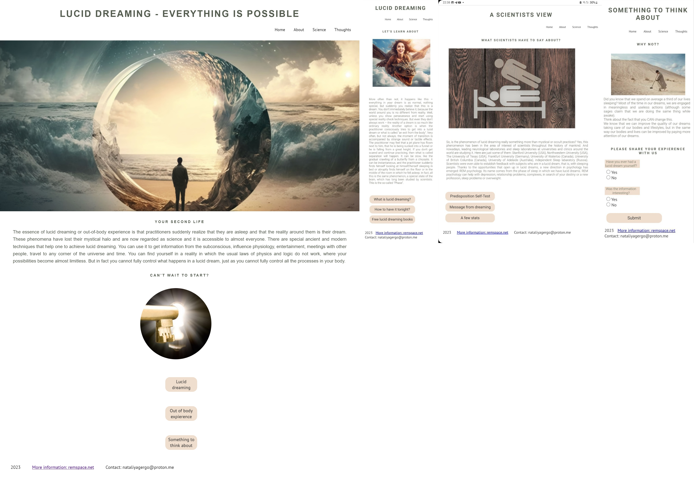

# LUCID DREAMING

Lucid Dreaming is a site that hopes to help people learn what are lucid dreams  and what science says about them. With the help of a test on a link on a third-party website, you can find out your individual predisposition to lucid dreams. My site hopes to encourage people to get their own personal experience of awareness in a dream. To do this, there is a link to a third-party website with detailed step-by-step instructions.

 